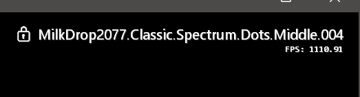

MDropDX12 is a ground-up DirectX 12 rebuild of the [MilkDrop2](https://www.geisswerks.com/milkdrop/) visualizer engine, with GPU-accelerated text rendering, an in-app settings UI, and broad preset compatibility improvements. Works with [Milkwave](https://github.com/shanevbg/Milkwave) Remote via WM_COPYDATA IPC for extended control (messaging, wave manipulation, screenshots, and more).

**Current version: 1.3** — version numbers from upstream projects (BeatDrop, MilkDrop3, etc.) do not apply to MDropDX12.

[**Click here**](https://github.com/shanevbg/MDropDX12/releases/latest) to get the latest version.



## Visualizer Features

* DirectX 12 rendering backend with GPU-accelerated Direct2D text overlay
* In-app Settings window (F8) with dark theme, 11-tab UI (General, Visual, Colors, System, Files, Messages, Sprites, Remote, Script, Displays, About)
* Preset browser with filtering, tagging, and subdirectory navigation
* Milkwave Remote IPC compatibility — non-blocking hidden window receives 32+ commands via WM_COPYDATA
* Configurable window titles for Remote discovery (Settings → Remote tab)
* Save Screenshot from Settings UI with file dialog, or via IPC `CAPTURE` command
* TDR recovery and GPU protection with automatic device restart
* Async shader compilation — non-blocking preset transitions, no render stalls
* Display current track information and artwork from Spotify, YouTube or other media sources playing on your PC
* Window title regex parsing with named profiles — extract artist/title/album from any media player's window title using configurable regex patterns with named capture groups
* Change preset on track change
* Set window transparency, borderless, and clickthrough ("watermark mode")
* HLSL variable shadowing fix for improved preset compatibility
* 3D volume texture support (noisevol_lq/noisevol_hq)
* Fallback texture search paths, Random Textures Directory, and resource viewer
* Over 5000 presets from skilled artists (more presets [here](https://github.com/projectM-visualizer/projectm?tab=readme-ov-file#presets))
* Improved window handling, input methods and stability
* Use independently or with [Milkwave](https://github.com/shanevbg/Milkwave) Remote for extended control (messaging, MIDI, shader conversion, wave manipulation, and more)

## Keyboard Shortcuts

### Window & Display

| Key | Action | Status |
| --- | ------ | ------ |
| Alt+Enter | Toggle fullscreen (or double-click) | ✅ |
| Alt+S | Toggle multi-monitor stretch (or mirror mode with failsafe prompt) | ✅ |
| Shift+Up/Down | Increase/decrease window opacity | ✅ |
| F1 | Show/hide help (2 pages) | ✅ |
| F2 | Toggle borderless window | ✅ |
| Ctrl+F2 | Reset window | ✅ |
| Ctrl+Shift+F2 | Set window to fixed dimensions from config | ✅ |
| F4 | Show/hide preset info | ✅ |
| F5 | Show/hide FPS | ✅ |
| F6 | Show/hide rating | ✅ |
| F7 | Always on top | ✅ |
| F9 | Toggle clickthrough mode | ✅ |
| Ctrl+F9 | Toggle windowed fullscreen | ✅ |
| Ctrl+Shift+F9 | Toggle watermark mode (windowed clickthrough fullscreen) | ✅ |
| F12 | Transparency mode (remove black background) | ✅ |
| Ctrl+F12 | Toggle black mode (no preset rendering) | ✅ |
| N | Show per-frame debug monitor | ✅ |
| Escape | Close menu / exit app (with confirmation) | ✅ |

### Presets

| Key | Action | Status |
| --- | ------ | ------ |
| Space | Soft cut to next random preset | ✅ |
| H | Hard cut to next preset | ✅ |
| Backspace | Go back to previous preset | ✅ |
| \` / ~ | Lock/unlock current preset | ✅ |
| Scroll Lock | Lock preset + toggle playlist | ✅ |
| R | Toggle random/sequential order | ✅ |
| L | Open preset browser | ✅ |
| M | Show/hide preset-editing menu | ✅ |
| S | Save preset as... | ✅ |
| Ctrl+S | Quicksave to /presets/Quicksave | ✅ |
| Ctrl+Shift+S | Quicksave to /presets/Quicksave2 | ✅ |
| Mouse wheel | Next/previous preset | ✅ |

### Shaders & Effects

| Key | Action | Status |
| --- | ------ | ------ |
| A | Random mini-mashup (Ctrl/Shift variants) | ✅ |
| ! | Randomize warp shader | ✅ |
| @ | Randomize comp shader | ✅ |
| D/d | Cycle shader locks (comp/warp/both/none) | ✅ |
| F11 | Cycle inject effect (off/brighten/darken/solarize/invert) | ✅ |
| Shift+F11 | Cycle hard cut mode (13 audio-reactive modes) | ✅ |

### Preset Parameters (live tweaking)

| Key | Action | Status |
| --- | ------ | ------ |
| W/w | Wave mode +/- | ✅ |
| E/e | Wave alpha +/- | ✅ |
| J/j | Wave scale +/- | ✅ |
| I/i | Zoom +/- | ✅ |
| U/u | Warp scale +/- | ✅ |
| O/o | Warp amount +/- | ✅ |
| G/g | Gamma +/- | ✅ |
| +/- | Brightness +/- | ✅ |
| \[/\] | X push +/- | ✅ |
| {/} | Y push +/- | ✅ |
| </> | Rotation +/- | ✅ |
| P/p | Video echo alpha +/- | ❌ Video echo not implemented in DX12 |
| Q/q | Video echo zoom +/- | ❌ Video echo not implemented in DX12 |
| F/f | Video echo orientation | ❌ Video echo not implemented in DX12 |

### Audio & Settings

| Key | Action | Status |
| --- | ------ | ------ |
| F3 | Cycle FPS limit (30/60/90/120/144/240/360/unlimited) | ✅ |
| Ctrl+F3 | Display current FPS setting | ✅ |
| F8 / Ctrl+L | Open Settings window | ✅ |
| Ctrl+D | Set audio device to default | ✅ |
| Ctrl+Shift+D | Display current audio device | ✅ |
| Ctrl+M | Toggle mouse interaction mode | ✅ |
| Ctrl+Q | Double render quality | ✅ |
| Ctrl+Shift+Q | Halve render quality (pixelize) | ✅ |
| Ctrl+H | Shift hue (Shift+ reverses) | ✅ |
| F10 / Ctrl+Z | Toggle Spout output (Shift+ sets fixed resolution) | ✅ |

### Screenshots & Media

| Key | Action | Status |
| --- | ------ | ------ |
| Ctrl+X | Save screenshot to /capture folder (also via Settings → Remote or IPC) | ✅ |
| T/t | Song title animation | ❌ Not rendering in DX12 |
| Ctrl+T | Kill custom messages/song titles | ❌ No effect (nothing to kill) |

### Sprites & Custom Messages

| Key | Action | Status |
| --- | ------ | ------ |
| K | Toggle sprite/message input mode | ✅ Handler works |
| 00-99 | Launch sprite or custom message | ⚠️ Sprites render; custom messages need testing |
| \* | Reload custom_messages.ini | ✅ |
| Delete | Kill newest sprite/message | ✅ |
| Shift+Delete | Kill oldest sprite/message | ✅ |
| Ctrl+Shift+Delete | Kill all sprites/messages | ✅ |
| Ctrl+K | Kill all sprites | ✅ |
| Shift+K | Enter sprite kill mode | ✅ |

## History

The original [MilkDrop2](https://www.geisswerks.com/milkdrop/) WinAmp plugin created by Ryan Geiss was turned into a Windows standalone application by Maxim Volskiy as [BeatDrop](https://github.com/mvsoft74/BeatDrop) and has since been improved upon eg. in the [BeatDrop-Music-Visualizer](https://github.com/OfficialIncubo/BeatDrop-Music-Visualizer) project. IkeC forked BeatDrop-Music-Visualizer into [Milkwave](https://github.com/IkeC/Milkwave), adding IPC remote control and other features. MDropDX12 originally started as a fork of IkeC's Milkwave.

MDropDX12 is maintained by [shanevbg](https://github.com/shanevbg). This version is a ground-up rebuild of the rendering engine on DirectX 12, replacing the original DX9Ex backend entirely. The text rendering pipeline, settings UI, texture management, shader compilation, and resource handling have all been rewritten. While preset compatibility with the MilkDrop2 ecosystem is maintained, the codebase has diverged significantly from the upstream projects.

For a more detailed explanation of all features, please read the [Manual](https://github.com/shanevbg/MDropDX12/blob/main/docs/Manual.md).

For a chronological list of MDropDX12 releases and features, read the [Changes](docs/Changes.md).

## System Requirements

* Windows 10 64-bit or higher (Windows 11 recommended)
* DirectX 12 compatible GPU
* [Microsoft Visual C++ Redistributable (x64)](https://aka.ms/vs/17/release/vc_redist.x64.exe)
* [Milkwave](https://github.com/shanevbg/Milkwave) (optional — configure window titles in Settings → Remote tab for IPC discovery)

## Installation

Download `MDropDX12-1.3-Portable.zip` from the [latest release](https://github.com/shanevbg/MDropDX12/releases/latest), extract to any folder with write access (e.g. `C:\Tools\MDropDX12`), and run `MDropDX12.exe`. No installer or admin privileges required.

See the [Installation Guide](docs/Install.md) for detailed instructions, directory layout, configuration files, and troubleshooting.

## Building from Source

MDropDX12 builds with MSVC v143 (Visual Studio 2022 Build Tools) and MSBuild. The build script auto-fetches the Spout2 SDK.

```powershell
git clone https://github.com/shanevbg/MDropDX12.git
cd MDropDX12
powershell -ExecutionPolicy Bypass -File build.ps1 Release x64
```

See the [Development Guide](docs/Development.md) for full setup instructions using VSCodium, debugging, project structure, and troubleshooting.

## Support

This project incorporates the work of many different authors over the years, as listed below. The entirety of this project is Open Source and there will never be a paid version of it.

If you find bugs or have feature requests, [open an issue](https://github.com/shanevbg/MDropDX12/issues) on GitHub.

## Acknowledgements

Many thanks to:

* IkeC - [Milkwave](https://github.com/IkeC/Milkwave)
* Ryan Geiss - [MilkDrop2](https://www.geisswerks.com/milkdrop/)
* Maxim Volskiy - [BeatDrop](https://github.com/mvsoft74/BeatDrop)
* oO-MrC-Oo - [XBMC plugin](https://github.com/oO-MrC-Oo/Milkdrop2-XBMC)
* Casey Langen - [milkdrop2-musikcube](https://github.com/clangen/milkdrop2-musikcube)
* Matthew van Eerde - [loopback-capture](https://github.com/mvaneerde/blog)
* projectM - [projectm-eval](https://github.com/projectM-visualizer/projectm-eval)
* Incubo_ - [BeatDrop-Music-Visualizer](https://github.com/OfficialIncubo/BeatDrop-Music-Visualizer)
* milkdrop2077 - [MilkDrop3](https://github.com/milkdrop2077/MilkDrop3)
* and all the preset authors!

If you believe you or someone else should be mentioned here, please [open an issue](https://github.com/shanevbg/MDropDX12/issues).

## License

[license]: #license

MDropDX12 is licensed under the [Creative Commons Attribution-NonCommercial 4.0 International License (CC-BY-NC 4.0)](https://creativecommons.org/licenses/by-nc/4.0/). See [LICENSE](LICENSE) for the full license text and [THIRD-PARTY-LICENSES.txt](THIRD-PARTY-LICENSES.txt) for third-party component licenses (Nullsoft/MilkDrop2, Cockos/ns-eel2, Spout2, loopback-capture).

## Public use of MilkDrop Presets

The presets themselves are not covered by either of these licenses, they either have their own license or none (in most cases). None of the presets in MDropDX12 should have a restrictive license preventing you from using them in public. All preset filenames from converted shaders have the original author's name in them, with the full original source mentioned in the preset file itself.

Always keep in mind that you are using the artistic work of someone else. Respect the original authors' work by showing the preset filename (at least briefly), and you should be fine. If in doubt, always ask the creator of the piece you use.

## Contributions

Unless you explicitly state otherwise, any contribution intentionally submitted for inclusion in the work by you, shall be licensed as above.
