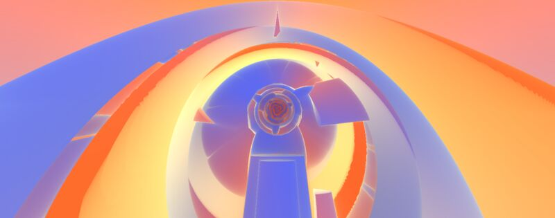
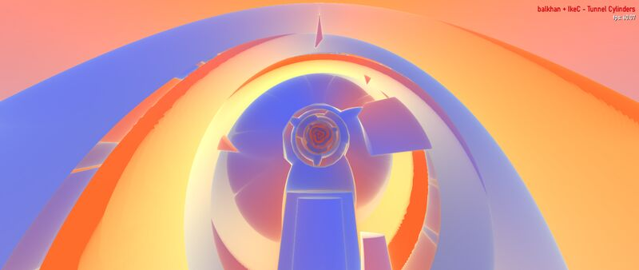
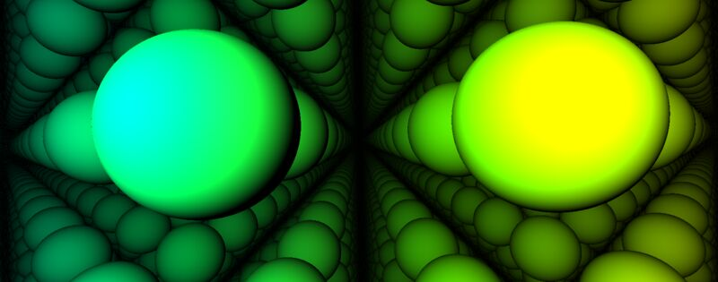
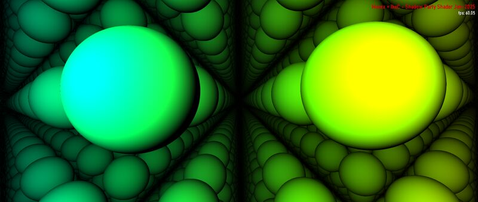
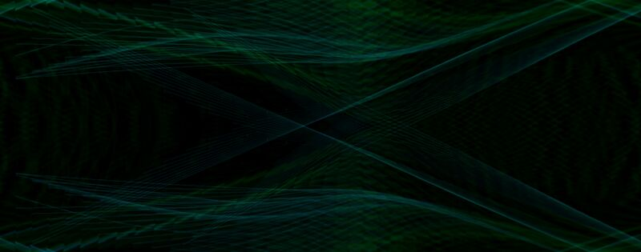
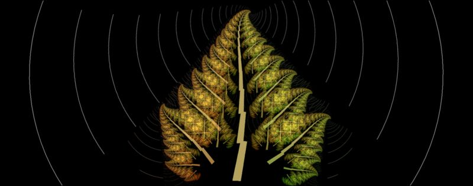
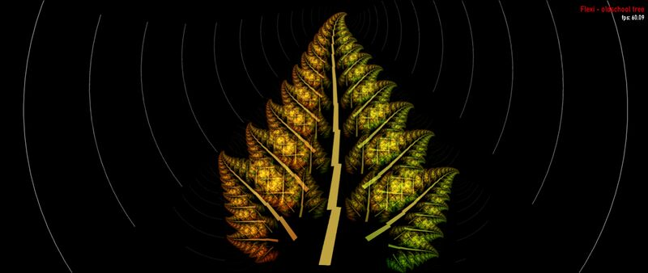
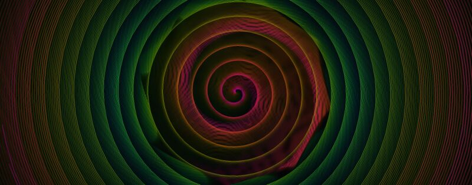

# Visual Comparison: MDropDX12 vs Milkwave Visualizer

Side-by-side visual comparison of preset rendering between MDropDX12 (DirectX 12) and Milkwave Visualizer (DirectX 9Ex).

| Project | Graphics API | Version |
| ------- | ------------ | ------- |
| **MDropDX12** | DirectX 12 | v2.4.0 |
| **Milkwave Visualizer** | DirectX 9Ex | v3.5 |

---

## Presets Compared

Each preset loaded on both visualizers simultaneously with identical audio.

### 1. Martin - blue haze

| MDropDX12 | Milkwave |
| --------- | -------- |
|  |  |

Both render the deep blue-purple background, concentric swirl rings, and bright particle fountain from center with matching color palette (pink/magenta strands, golden highlights, white-hot core). The fire orb sprite renders correctly on both. No visible differences in warp distortion, color grading, or particle behavior.

**Verdict:** Visually equivalent.

### 2. BrainStain - re entry

| MDropDX12 | Milkwave |
| --------- | -------- |
|  |  |

This preset uses two textured non-additive custom shapes (99-sided circles) with aggressive decay (`fDecay=0.5`) and audio-driven zoom (`bass_att`). Multiple DX9→DX12 differences were found and fixed:

1. **Alpha feedback** (fixed): DX9 used `X8R8G8B8` render targets (no alpha). DX12's `R8G8B8A8_UNORM` stored alpha, which compounded through the feedback loop. Fixed with RGB-only write mask on all shape PSOs.
2. **Warp decay** (fixed): DX9 applied decay via fixed-function texture stage modulate (`D3DTOP_MODULATE × D3DTA_DIFFUSE`). DX12 warp shader was missing this — now injects `ret *= _vDiffuse.rgb` in the output wrapper, and `GenWarpPShaderText` generates the decay multiply in the shader body for auto-gen presets.
3. **VS[1] clear alpha** (fixed): Changed from 0.0 to 1.0 to match DX9's implicit alpha.

With these fixes, BrainStain is audio-reactive and shows the correct starburst structure. Brightness level is close but not identical — MDropDX12 runs slightly brighter at moderate volumes. The extreme `fDecay=0.5` amplifies any small difference in the feedback loop. Color differences are expected (time-based wave color modulation cycles independently).

**Verdict:** Close match — structure and reactivity correct, minor brightness difference at some volumes.

### 3. balkhan + IkeC - Tunnel Cylinders

| MDropDX12 | Milkwave |
| --------- | -------- |
|  |  |

This is a comp shader preset with 3D raymarched tunnel geometry. Both renderers produce the same concentric cylindrical tunnel structure with identical blue/orange/peach color gradients, geometric faceting, and spiral depth recession. The central rose-spiral focal point and floating arrow shapes match exactly.

**Verdict:** Visually equivalent.

### 4. Marex + IkeC - Shadow Party Shader Jam 2025

| MDropDX12 | Milkwave |
| --------- | -------- |
|  |  |

Both render the raymarched scene of reflective green-to-yellow spheres in a recursive lattice with specular highlights and ambient occlusion. The sphere geometry, color gradients, and lattice structure match. Previously rendered black on MDropDX12 due to HLSL error X3005 — a local variable `R2D` shadowed a user-defined function of the same name (valid in GLSL, not HLSL). Fixed by `FixShadowedUserFunctions` in engine_shaders.cpp.

**Verdict:** Visually equivalent (fixed).

### 5. Illusion & Rovastar - Clouded Bottle

| MDropDX12 | Milkwave |
| --------- | -------- |
|  |  |

Both render the same dark scene with green waveform threads crossing in an X-pattern. The wave line density, color (dark green), and crossing geometry are consistent. MDropDX12 shows slightly more blue tint in some threads; Milkwave's lines appear marginally denser. The overall composition and mood match.

**Verdict:** Visually equivalent.

### 6. martin - deep blue

| MDropDX12 | Milkwave |
| --------- | -------- |
|  |  |

Both render deep-sea organic tentacle/tube structures against a dark navy background with matching cyan-green edge glow and internal blue shading. The tube shapes, branching patterns, and color gradients are consistent. Milkwave's tubes appear slightly thicker due to different window resolution at capture time.

**Verdict:** Visually equivalent.

### 7. martin - push ax

| MDropDX12 | Milkwave |
| --------- | -------- |
|  |  |

Both render a 3D voxel cityscape / cube matrix with rainbow color gradients (green, orange, pink, purple). The recursive cube geometry, reflective surfaces, and lit window patterns are present on both. Frame captures differ in camera angle due to chaotic animation timing, but the same visual elements and color palette are rendered.

**Verdict:** Visually equivalent.

### 8. shifter - escape the worm (Eo.S. + Phat mix)

| MDropDX12 | Milkwave |
| --------- | -------- |
|  |  |

Both render the worm-tunnel perspective with colored block walls (blue/purple on left, teal/green on right) and a central triangular waveform shape with spiral trail. The block mosaic pattern, color gradients, and tunnel depth are consistent. Camera position differs slightly due to animation timing.

**Verdict:** Visually equivalent.

### 9. Flexi - oldschool tree

| MDropDX12 | Milkwave |
| --------- | -------- |
|  |  |

Both render the fractal tree with autumn-colored leaves (orange-brown to yellow-green gradient, left to right) against a black background with concentric ring ripples emanating from center. The leaf geometry, branching structure, trunk, and internal tile patterns are identical. Audio-reactive ring ripples match in spacing and intensity.

**Verdict:** Visually equivalent.

### 10. martin - axon3

| MDropDX12 | Milkwave |
| --------- | -------- |
|  |  |

Both render dark, iridescent organic neural/axon structures with flowing tentacle shapes, chromatic highlights (red, cyan, yellow, purple), and a deep biological aesthetic. The rendering style, color palette, and organic distortion are consistent. Exact frame content differs due to chaotic per-frame animation, but the visual quality and complexity match.

**Verdict:** Visually equivalent.

### 11. Zylot - Spiral (Hypnotic) Phat Double Spiral Mix

| MDropDX12 | Milkwave |
| --------- | -------- |
|  |  |

Both render the hypnotic double spiral with concentric rings in green, pink/red, and dark tones. The spiral geometry, color banding, and fine-line texture within the rings are identical. The warp-driven rotation and color distribution match precisely.

**Verdict:** Visually equivalent.

---

## Summary

| # | Preset | Result |
|---|--------|--------|
| 1 | Martin - blue haze | Equivalent |
| 2 | BrainStain - re entry | Close match — fixed alpha/decay, minor brightness diff at some volumes |
| 3 | balkhan + IkeC - Tunnel Cylinders | Equivalent |
| 4 | Marex + IkeC - Shadow Party Shader Jam 2025 | Equivalent (fixed — was black, X3005 variable/function shadow) |
| 5 | Illusion & Rovastar - Clouded Bottle | Equivalent |
| 6 | martin - deep blue | Equivalent |
| 7 | martin - push ax | Equivalent |
| 8 | shifter - escape the worm (Eo.S. + Phat mix) | Equivalent |
| 9 | Flexi - oldschool tree | Equivalent |
| 10 | martin - axon3 | Equivalent |
| 11 | Zylot - Spiral (Hypnotic) Phat Double Spiral Mix | Equivalent |

**All 11 presets** render with matching structure and behavior. Three presets required fixes: #2 (RT alpha feedback + missing warp decay), #4 (variable shadowing user function, HLSL X3005), and #7 (FixShadowedUserFunctions). #2 has a minor brightness difference at some volumes due to extreme `fDecay=0.5` amplifying small feedback loop differences.
